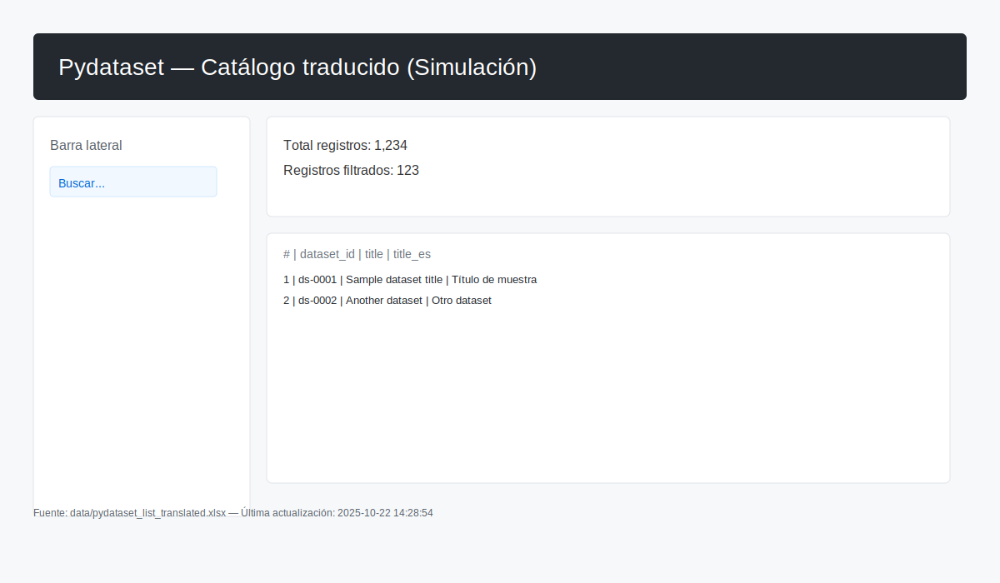

# Pydatasets Streamlit (estructura mínima)

Este repositorio contiene una estructura mínima para una aplicación Streamlit que carga y muestra
un archivo Excel con la lista de datasets traducidos.

Estructura creada:

- `app.py` — aplicación Streamlit mínima.
- `data/` — carpeta donde debe colocarse el archivo fuente `pydataset_list_translated.xlsx`.
- `.streamlit/config.toml` — configuración mínima de Streamlit (puerto, CORS, tema).
- `requirements.txt` — dependencias necesarias.
- `.gitignore` — reglas para ignorar virtualenvs y cachés, además de archivos de datos locales.

Archivo fuente

La aplicación espera el archivo:

	data/pydataset_list_translated.xlsx

Coloca tu archivo con ese nombre dentro de la carpeta `data/` antes de ejecutar la aplicación.

Ejecución local

1. Crear y activar un entorno virtual (opcional pero recomendado):

```bash
python -m venv .venv && source .venv/bin/activate  # (Windows: .venv\Scripts\activate)
```

2. Instalar dependencias:

```bash
pip install -r requirements.txt
```

3. Ejecutar la app:

```bash
streamlit run app.py
```

Captura de pantalla (simulada)



La imagen anterior es una captura de ejemplo que muestra la interfaz con búsqueda, métricas y tabla paginada. Sustituye por una captura real si la tienes.

Solución de problemas

- Error al instalar Pillow o al compilar dependencias nativas:
    - Mensaje típico: "The headers or library files could not be found for jpeg"
    - Solución en Ubuntu/Debian: `sudo apt-get update && sudo apt-get install -y libjpeg-dev zlib1g-dev libtiff-dev libopenjp2-7-dev libfreetype-dev libwebp-dev build-essential pkg-config`

- Puerto 8501 en uso:
    - Mensaje en logs: "Port 8501 is already in use"
    - Solución: detener la instancia que usa el puerto (por ejemplo `ps aux | grep streamlit` y `kill <PID>`), o arrancar en otro puerto: `streamlit run app.py --server.port 8502`.

- El Excel tiene múltiples hojas o no carga las columnas esperadas:
    - La app solicita subir el archivo o seleccionar la hoja cuando encuentre varias.
    - Asegúrate de que el archivo contenga las columnas obligatorias: `dataset_id`, `title`, `title_es`.

- Errores durante `streamlit run` relacionados con CORS/XSRF:
    - Verás una advertencia si `server.enableCORS` y `server.enableXsrfProtection` están en conflicto; normalmente no impide ejecutar localmente.

Si necesitas más ayuda, copia aquí la salida del terminal o del archivo `.streamlit_run.log` y lo reviso.

Despliegue

Puedes desplegar esta aplicación en Streamlit Community Cloud o en cualquier plataforma que soporte
aplicaciones Python (Heroku, Railway, etc.). Pasos generales para Streamlit Cloud:

- Sube este repositorio a GitHub.
- En Streamlit Cloud, conecta tu repo y selecciona la rama `main`.
- Como comando de ejecución usa `streamlit run app.py`.
- Asegúrate de que `requirements.txt` esté presente para que Streamlit instale las dependencias.

Notas

- Este proyecto ignora por defecto archivos en `data/` (ver `.gitignore`). Si quieres versionar el Excel,
  quita o modifica la línea correspondiente.
- El archivo `app.py` es solo una demostración mínima. Puedes mejorarlo añadiendo paginación,
  filtros por columna o exportación de resultados.

Documentación de pydataset
--------------------------

Se ha añadido una página dedicada que muestra documentación de los datasets disponibles en la
biblioteca `pydataset`.

Dónde está

- Archivo: `pages/02_Documentacion_pydataset.py`

Qué hace

- Lista un catálogo resumido (columnas `dataset_id`, `title`, `package`) y permite filtrar por texto.
- Permite seleccionar un `dataset_id` y ver su `data_info()` y la salida completa de `data(name, show_doc=True)`.
- Muestra una vista previa opcional (primeras 10 filas) cuando está disponible.

Requisitos

- La página usa `pydataset`. Si no está instalada, la página muestra un `st.error` indicando que añadas
    `pydataset` a `requirements.txt`.

Cómo usar

1. Asegúrate de tener el entorno y dependencias instaladas:

```bash
source .venv/bin/activate
pip install -r requirements.txt
```

2. Ejecuta la app con Streamlit (la página está en el directorio `pages` y se cargará automáticamente):

```bash
streamlit run app.py
```

3. Abre la URL que Streamlit muestra en el terminal (por ejemplo `http://localhost:8501`).

Notas

- La lista de datasets depende de la versión de `pydataset` instalada y puede variar entre entornos.
- La documentación se muestra tal como la entrega `show_doc=True` de `pydataset`.

